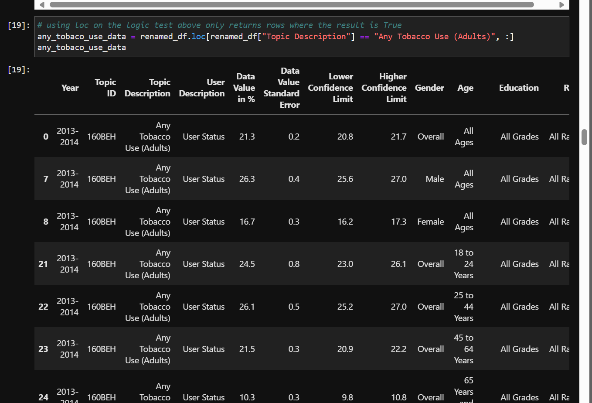
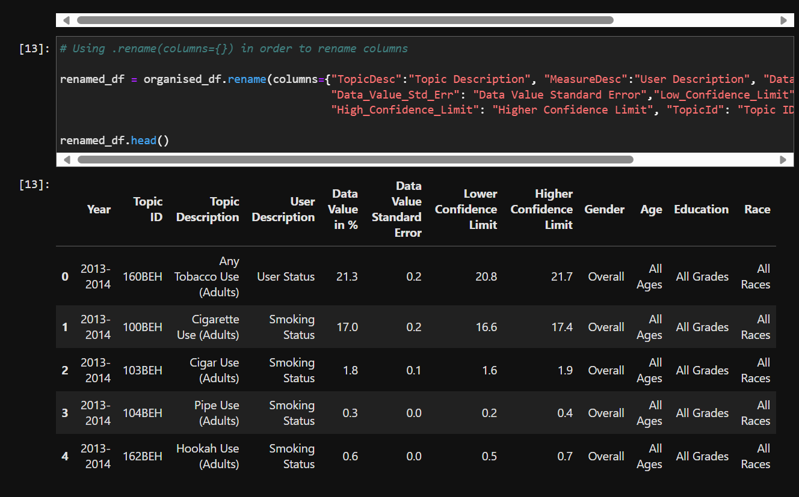
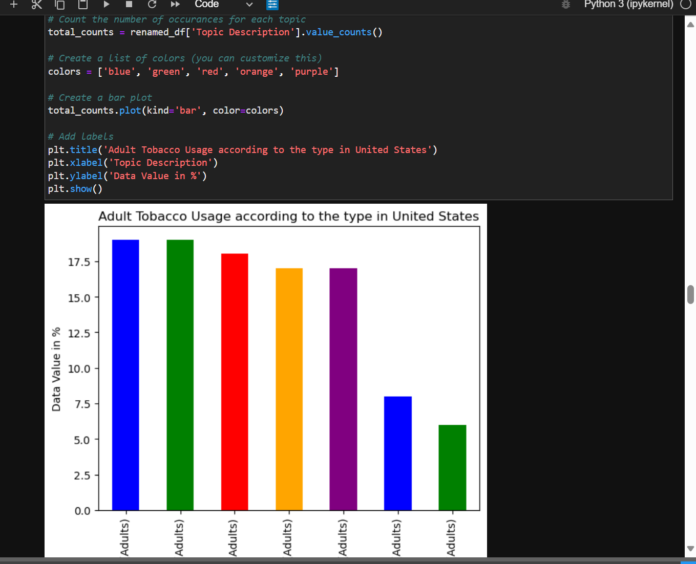
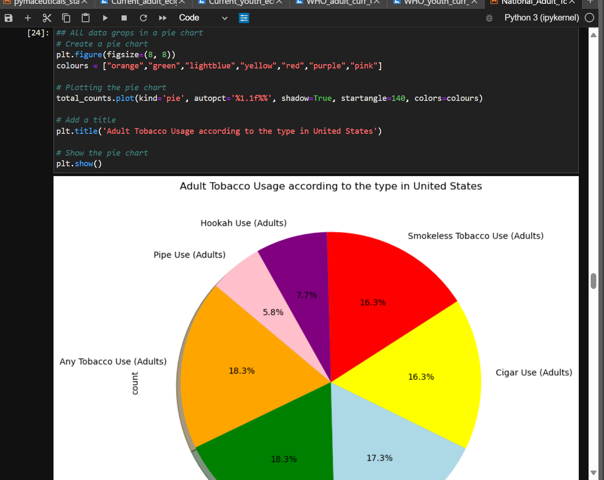
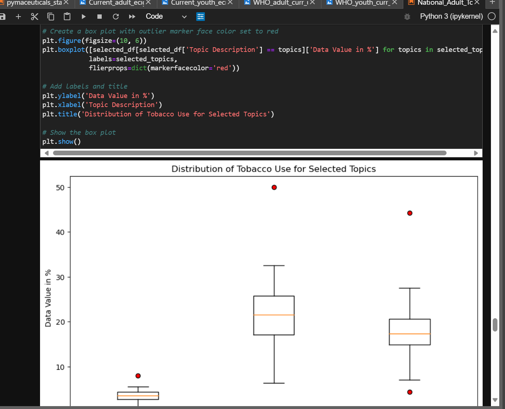

## Project Topic 
 * E-cigarettes or vapes are a significant and emerging public health challenge. 
There is growing evidence that e-cigarette use can lead to nicotine addiction, with the normalisation of vaping in children and young people.

## Purpose
* Gaining an in depth understanding of the accessibility of non-prescription e-cigarettes with Age group, Education status & gender wise adoption.

* Understanding and use of Python/Pandas functionality for data analysis and visualization.

## Resources & references

* Following resources were used for data analysis
   * "World Health Organisation"  https://www.who.int/data/gho/info/gho-odata-api
   * "National Adult Tobacco Survey (NATS)”  https://catalog.data.gov/dataset/national-adult-tobacco-survey-nats

   * “CDC STATE System E-Cigarette Legislation - Youth Access” https://catalog.data.gov/dataset/cdc-state-system-e-cigarette-legislation-youth-access

## Methods & Tools
   * Pandas & Jupyter notebook used for data cleaning, data formatting & data exploration.
   * .CSV file used as base data source.
   * Data visualization through multidimensional data frames, bar charts, pie charts etc.

