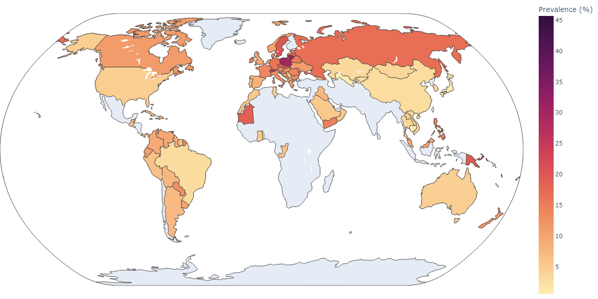
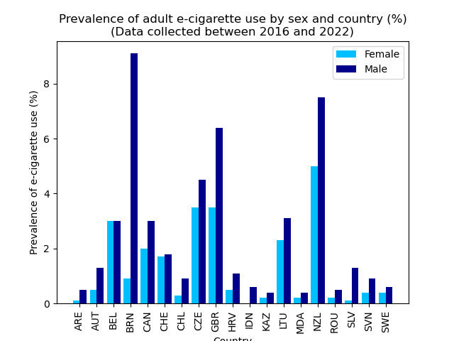
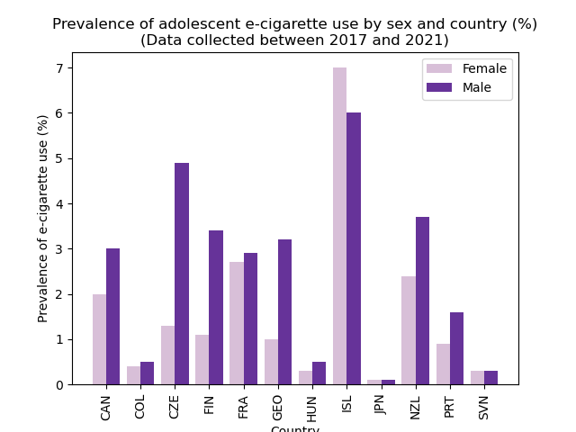
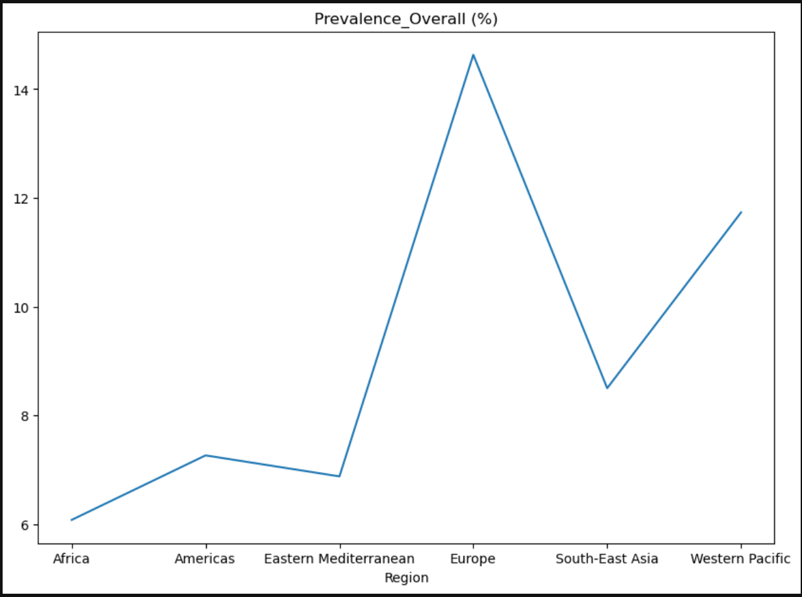
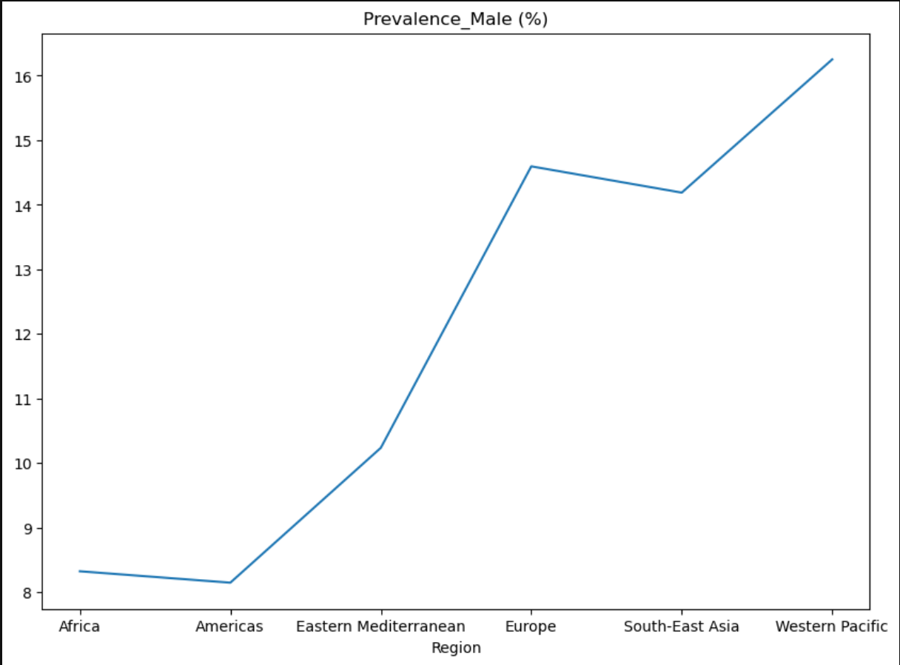
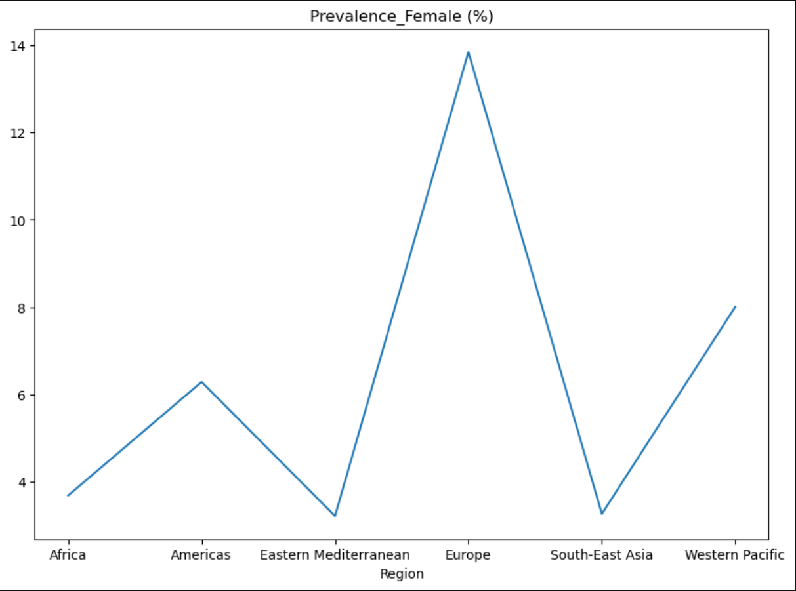

# Project Topic

E-cigarettes or vapes are a significant and emerging public health challenge. There is growing evidence that e-cigarette use can lead to nicotine addiction, with the normalisation of vaping in children and young people.

Ref:(https://www.wfla.com/wp-content/uploads/sites/71/2023/10/GettyImages-1396683789.jpg?w=876&h=493&crop=1))

## Purpose

Gain an understanding of the use of e-cigarettes across the world, types of tobacco use in the United States, and e-cigarette use by age group, education status & sex.

## Resources

The following resources were used for data analysis:

* "World Health Organisation" [https://www.who.int/data/gho/info/gho-odata-api](https://www.who.int/data/gho/info/gho-odata-api)
* "National Adult Tobacco Survey (NATS)” [https://catalog.data.gov/dataset/national-adult-tobacco-survey-nats](https://catalog.data.gov/dataset/national-adult-tobacco-survey-nats)
* “CDC STATE System E-Cigarette Legislation - Youth Access” [https://catalog.data.gov/dataset/cdc-state-system-e-cigarette-legislation-youth-access](https://catalog.data.gov/dataset/cdc-state-system-e-cigarette-legislation-youth-access)

## Research Questions

**1. What is the prevalence of e-cigarette use among adults and adolescents across the world?**

   The country with the highest prevalence of e-cigarette use among adults (overall) is Brunei (16.7%). Data collected between 2013 and 2022.

   The country with the highest prevalence of e-cigarette use among adolescents (10-19 years old) (overall) is Palau (45.7%). Data collected between 2014 and 2022.

   Adult | Adolescent
   --- | ---
    | 

   The country with the highest prevalence of daily adult e-cigarette use is Brunei for males (9.1%) and for New Zealand for females (5.0%).

   The country with the highest prevalence of daily adolescent e-cigarette use is Iceland for both males (6.0%) and females (7.0%).

   Adult | Adolescent
   --- | ---
    | 

   Male Prevalence | Female Prevalence 
   --- | ---
   )|)
* Country with the highest prevalence among Male is Papua New Guinea (29.9%).
* Country with the highest prevalence among Female is Bulgaria(36%).

Male Prevalence | Female Prevalence | Overall
   --- | --- | ----  
   ||

* Europe has the highest average prevalence overall @ 14.63%.
* Western Pacific has the highest average prevalence Male @ 16.26% 
* Europe has the highest average prevalence among female @ 13.84%

**2. What types of tobacco do adults use in the United States and how does the distribution of e-cigarette use compare to other tobacco types?**

   National Adult Tobacco Survey (NATS) has been conducted to assess the prevalence of tobacco use, as well as the factors promoting and impeding tobacco use among adults in United States.

   

   E-Cigrarette useage in US has been reported at (17.3%) which is slightly lower than the Cigarette use which has been reported at (18.3%).
   
   Gender distribution and age distribution has been reported at (5.6%) distributed evenly among following categories,
   (18 to 24 Years', '25 to 44 Years', '45 to 64 Years','65 Years and Older')

   .png)
   
   Key findings from National Adult Tobacco Survey ,

   * E-cigarette use is becoming increasingly popular, (17.3%) of adults reported using e-cigarettes.
   * Cigarette smoking is the most common form of tobacco use in the United States. About (18.3%) of adults reported smoking cigarettes.
   * Other forms of tobacco use, such as cigars, pipes, and smokeless tobacco, are less common, (16.3%) of adults reported using cigars, 5.8% reported using pipes, and 16.3% reported using smokeless tobacco.

   Following box plot describes the distribution of tobacco use for selected categories, 

   

**3. Placeholder for Question 3**

   Legislation?

## References

* [Show all columns in a DataFrame](https://saturncloud.io/blog/python-spyder-display-all-columns-of-a-pandas-dataframe-in-describe/#:~:text=To%20display%20all%20columns%2C%20you,there%20are%20in%20the%20DataFrame.&text=Now%2C%20when%20you%20use%20the,all%20columns%20will%20be%20displayed.)
* [Replace character in string value of a column of a DataFrame](https://www.quora.com/How-do-you-delete-quotes-and-double-quotes-from-DataFrame-Python-regex-pandas-dataframe-development)
* [Create a map using only country codes - plotly Choropleth](https://plotly.com/python/choropleth-maps/)
* [Enlarge choropleth map](https://stackoverflow.com/questions/63466163/how-to-enlarge-geographic-map-in-python-plotly-choropleth-plot)
* [Setting additional attributes for group bar charts](https://matplotlib.org/stable/gallery/lines_bars_and_markers/barchart.html)
* [Create a grouped bar chart](https://www.geeksforgeeks.org/create-a-grouped-bar-plot-in-matplotlib/)
