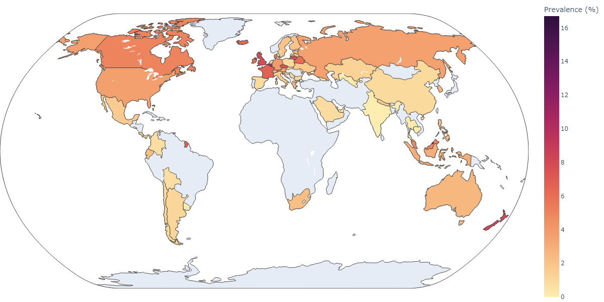
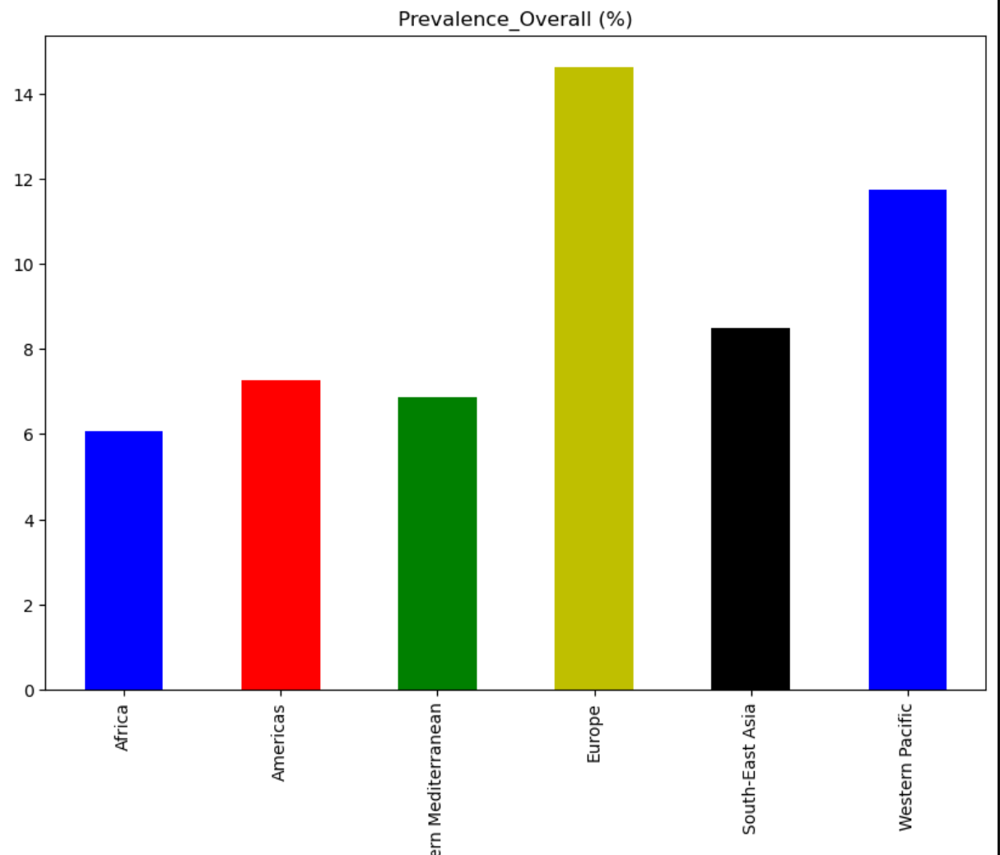
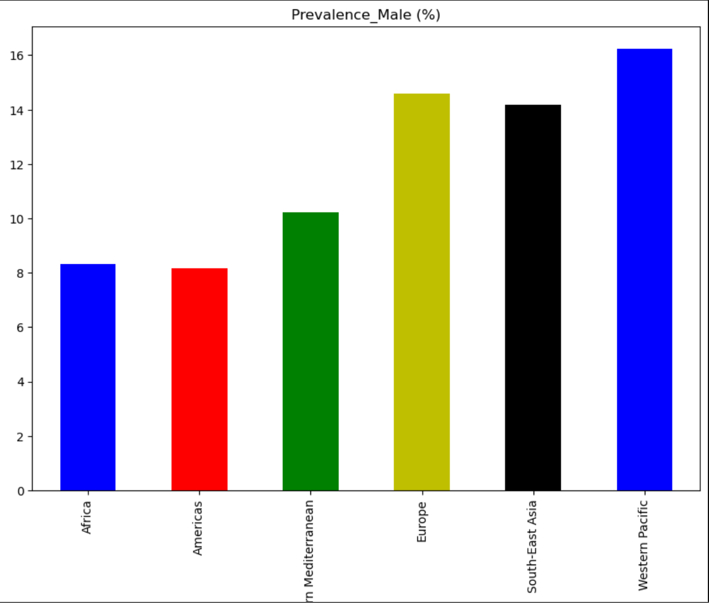
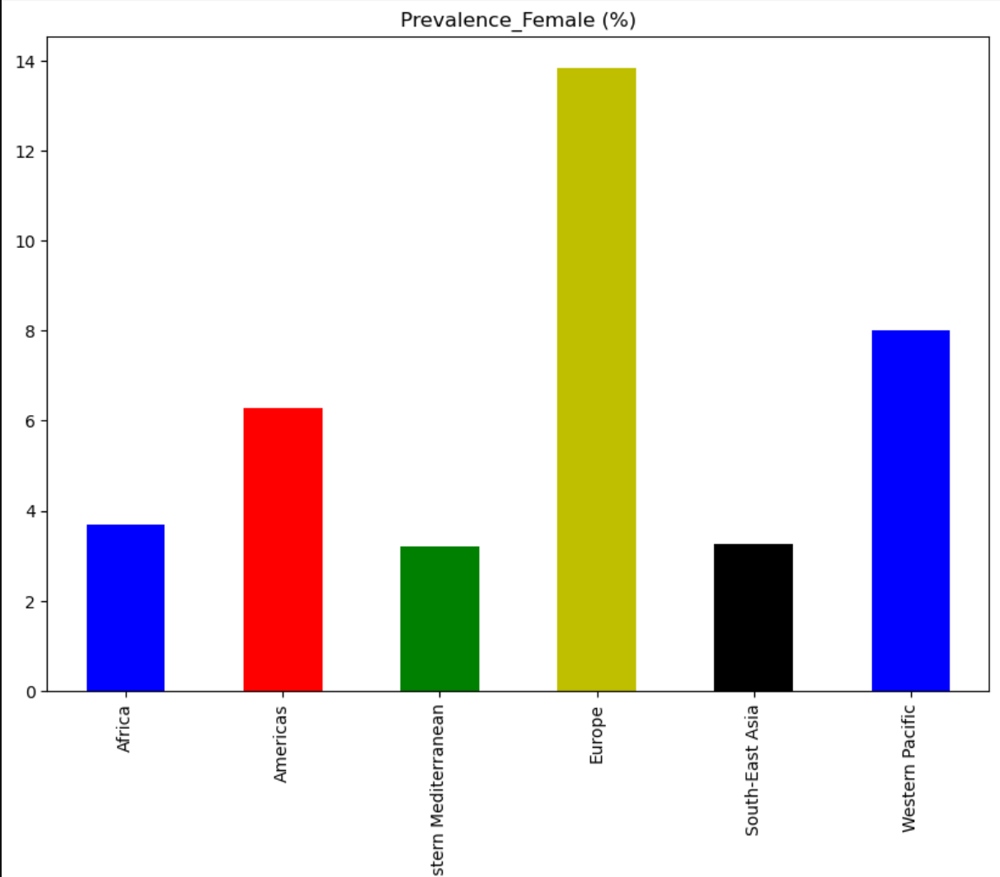
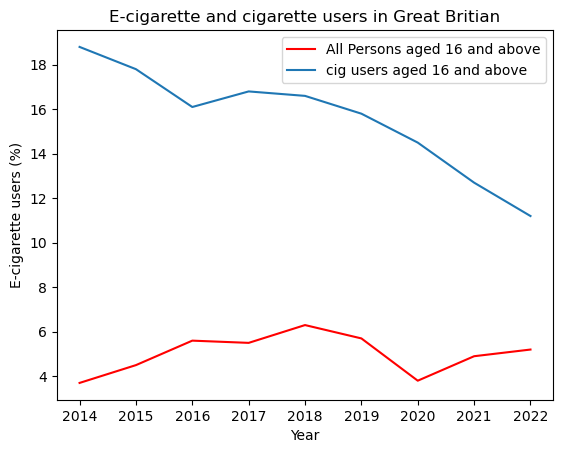
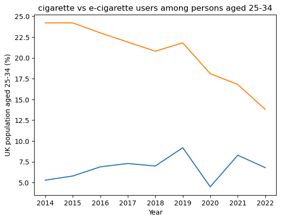

# Project Topic

E-cigarettes or vapes are a significant and emerging public health challenge. There is growing evidence that e-cigarette use can lead to nicotine addiction, with the normalisation of vaping in children and young people.

 [(Image reference link)](https://www.wfla.com/wp-content/uploads/sites/71/2023/10/GettyImages-1396683789.jpg?w=876&h=493&crop=1)

## Purpose

Gain an understanding of the use of e-cigarettes across the world, types of tobacco use in the United States, and e-cigarette use by age group, education status & sex.  

For more detailed analysis, please view the presentation in `Project_1/Project1_Grp5_ecigarette.pdf` and the jupyter notebooks `Project_1/Code/National_Adult_Tobacco_Survey US & GB statistics.ipynb` and `Project_1/Code/WHO_analysis.ipynb`

## Data sources

* World Health Organisation [https://www.who.int/data/gho/info/gho-odata-api](https://www.who.int/data/gho/info/gho-odata-api)
* National Adult Tobacco Survey (NATS) [https://catalog.data.gov/dataset/national-adult-tobacco-survey-nats](https://catalog.data.gov/dataset/national-adult-tobacco-survey-nats)
* Adult Smoking Habits in England [https://www.ons.gov.uk/peoplepopulationandcommunity/healthandsocialcare/healthandlifeexpectancies/datasets/adultsmokinghabitsinengland](https://www.ons.gov.uk/peoplepopulationandcommunity/healthandsocialcare/healthandlifeexpectancies/datasets/adultsmokinghabitsinengland)

## Research Questions

### 1. What is the prevalence of e-cigarette use among adults and adolescents across the world?

   The country with the highest prevalence of e-cigarette use among adults (overall) is Brunei (16.7%). Data collected between 2013 and 2022.

   The country with the highest prevalence of e-cigarette use among adolescents (10-19 years old) (overall) is Palau (45.7%). Data collected between 2014 and 2022.

   Adult | Adolescent
   --- | ---
    | 

   The country with the highest prevalence of daily adult e-cigarette use is Brunei for males (9.1%) and for New Zealand for females (5.0%).

   The country with the highest prevalence of daily adolescent e-cigarette use is Iceland for both males (6.0%) and females (7.0%).

   Adult | Adolescent
   --- | ---
    | 

   Male Prevalence | Female Prevalence
   --- | ---
    | 

* Country with the highest prevalence for males is Papua New Guinea (29.9%)
* Country with the highest prevalence for females is Bulgaria (36%)

   Overall | Male Prevalence | Female Prevalence
   --- | --- | ----
   ||

* Europe has the highest average prevalence overall @ 14.63%.
* Western Pacific has the highest average prevalence Male @ 16.26%
* Europe has the highest average prevalence among female @ 13.84%

### 2. What types of tobacco do adults use in the United States and how does the distribution of e-cigarette use compare to other tobacco types?

   National Adult Tobacco Survey (NATS) has been conducted to assess the prevalence of tobacco use, as well as the factors promoting and impeding tobacco use among adults in United States.

   
   

* E-Cigrarette usage in US has been reported at (17.3%) which is slightly lower than the Cigarette use which has been reported at (18.3%).

* Gender distribution and age distribution has been reported at (5.6%) distributed evenly among following categories,
   (18 to 24 Years', '25 to 44 Years', '45 to 64 Years','65 Years and Older')

* The popularity of e-cigarettes among young adults is a public health concern, as e-cigarettes contain nicotine, which is addictive and can harm the developing brain.

   

   Key findings from National Adult Tobacco Survey:

* E-cigarette use is becoming increasingly popular, (17.3%) of adults reported using e-cigarettes.
* Cigarette smoking is the most common form of tobacco use in the United States. About (18.3%) of adults reported smoking cigarettes.
* Other forms of tobacco use, such as cigars, pipes, and smokeless tobacco, are less common, (16.3%) of adults reported using cigars, 5.8% reported using pipes, and 16.3% reported using smokeless tobacco.

   The following box plot describes the distribution of tobacco use for selected categories:

* E-cigarette use: The median is the lowest of the three types of tobacco, and the IQR is also the smallest. This means that e-cigarette use is less common than other types of tobacco use, and there is less variation in e-cigarette use among adults.

* Any tobacco use:  The median is the highest of the three types of tobacco. The IQR is also larger than e-cigarette use, but smaller than cigarette use. This indicates that any other tobacco use is more common than e-cigarette use, but less common than cigarette use and there is more variation in any tobacco use than e-cigarette usage. 

### 3. How has cigarette and e-cigarette use changed over time in the United Kingdom 

   The office of National Statistics conduct a nation wide survey every 10 years to provide a comprehensive overview of the United Kingdom population. This Survey determins key characteristics that the population may have. This allows Businesses and Govenrment agencies to make educated decisions.  
    
   * The UK dataset has shown that there is little to no corelation between e-cigarette and cigarette users among the population as a whole. 
   * Although there has been a rapid decline in cigarette users, showing the lowest numbers of all time in the United Kingdom. E-cigarette users have not increased at the same rate of the decline as cigarette users.  
 
* From 2014 to 2019, the data shows that there was a decline of cigarette smokers and increase of e-cigarette users. 
* From 2020 onwards however, there was a apike and a slow decline. Rather the 2022 data shows that both cigarette and e-cigarette use both went down. 

In conclsion, the data shows there is no direct relationship with quitting traditional smoking and e-cigarette use, rather an indirect relationship.

## References

* [Show all columns in a DataFrame](https://saturncloud.io/blog/python-spyder-display-all-columns-of-a-pandas-dataframe-in-describe/#:~:text=To%20display%20all%20columns%2C%20you,there%20are%20in%20the%20DataFrame.&text=Now%2C%20when%20you%20use%20the,all%20columns%20will%20be%20displayed.)
* [Replace character in string value of a column of a DataFrame](https://www.quora.com/How-do-you-delete-quotes-and-double-quotes-from-DataFrame-Python-regex-pandas-dataframe-development)
* [Create a map using only country codes - plotly Choropleth](https://plotly.com/python/choropleth-maps/)
* [Enlarge choropleth map](https://stackoverflow.com/questions/63466163/how-to-enlarge-geographic-map-in-python-plotly-choropleth-plot)
* [Setting additional attributes for group bar charts](https://matplotlib.org/stable/gallery/lines_bars_and_markers/barchart.html)
* [Create a grouped bar chart](https://www.geeksforgeeks.org/create-a-grouped-bar-plot-in-matplotlib/)
